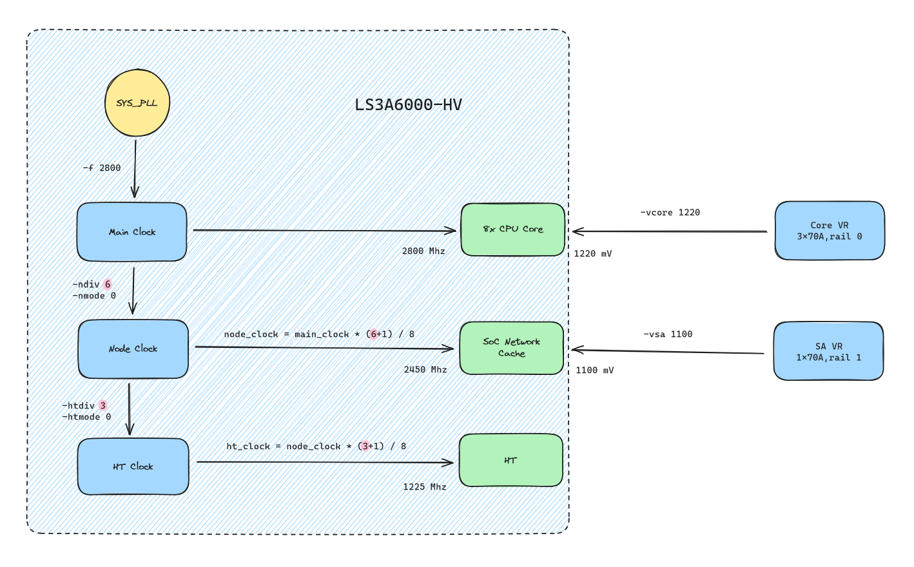

# LS-3A6000 Overclock BIOS



## Introduction

These BIOS firmware modded two modules

* XA61200OverclockPeim
* XA61200OverclockShellCommand

the `XA61200OverclockPeim` module execute in early PEI stage and read overclock settings from EFI Variable. If EFI Variable `LsOcConf` is valid and overclock is enabled, CPU core voltage and Main Clock frequency will be set here.

the `XA61200OverclockShellCommand` register a `overclock` command in EFI shell, provide command options in chapter #Usage

## Files

`UDK2018-3A6000-7A2000_EVB_V4.0.05634_prestable2311dbg-overclock-v2.fd` is **recommended** to use

* `Loongson-XA61200-UDK2018-V4.0.05494-stable202305-overclock-sa.bin`: This BIOS included overclock modding and support sa voltage adjustment
* `Loongson-XA61200-UDK2018-V4.0.05494-stable202305-overclock.bin`: This BIOS included overclock modding, only support core voltage adjustment
* `Loongson-XA61200-UDK2018-V4.0.05494-stable202305.bin`: This BIOS is the original backup of my board
* `UDK2018-3A6000-7A2000_EVB_V4.0.05634_prestable2311dbg-overclock.fd`: This BIOS is the 2023/11 version with overclock modding
* `UDK2018-3A6000-7A2000_EVB_V4.0.05634_prestable2311dbg-overclock-v2.fd`: This BIOS is the 2023/11 version with advanced clock and overclock modding

## Usage

### Program firmware into flash

0. backup your BIOS via SPI Flash Programmer
1. Format a USB drive with FAT32 partition
2. Copy BIOS firmware to the USB drive
3. Insert your USB drive, power on motherboard
4. Enter BIOS setup, select `Security` - `Firmware Update`, and select the firmware you desire to flash
5. Hit enter and wait 2-3 minutes

### UEFI Shell command

You can use `help overclock` in UEFI Shell to get help message

```
Configure XA61200 overclock settings.
 
overclock -p
overclock -e 1
overclock -vcore 1200
overclock -vsa 1200
overclock -f 2700
overclock -ndiv 7
overclock -nmode 0
overclock -htdiv 2
overclock -htmode 0
 
  -p          - Print overclock settings.
  -e          - Enable/Disable overclock settings.
  -vcore      - Set CPU core voltage (mV).
  -vsa        - Set CPU SA voltage (mV).
  -f          - Set CPU Main Clock frequency (MHz).
  -ndiv       - Set Node0_freq_ctrl register.
  -nmode      - Set freqscale_mode_node register.
  -htdiv      - Set HT_freq_scale_ctrl register.
  -htmode     - Set freqscale_mode_HT register.
  .
 
NOTES:
  1. Voltage(Core and SA) must between 1000 - 1350 mV
  2. Frequency must between 2500 - 3200 Mhz
  3. Use '-e 1' to enable overclock, '-e 0' to disable overclock
  4. Overclock settings will store in EFI variable
     If your settings make motherboard stop working, try erase NVRAM
  5. '-nmode' and '-htmode' can be '0' or '1'
     '0' means (n+1)/8
     '1' means 1/(n+1)
```

Then you can overclock your CPU like below. These values are for demo purposes only and are **NOT GURANTEE TO WORK**.

```
# enable overclock
Shell> overclock -e 1

# disable overclock
Shell> overclock -e 0

# set overclock frequency (Mhz)
Shell> overclock -f 2800

# set overclock core voltage (mV)
Shell> overclock -vcore 1230

# set overclock sa voltage (mV)
Shell> overclock -vsa 1200

# set node clock div
Shell> overclock -ndiv 6

# print current overclock settings
Shell> overclock -p
Overclock status: ENABLE
Overclock Main clock: 2800 Mhz
Overclock Core voltage: 1230 mV
Overclock SA voltage: 1200 mV
Overclock Node clock div: 6
Overclock Node clock mode: (n+1)/8
Overclock Node clock: 2450 Mhz
Overclock HT clock div: 3
Overclock HT clock mode: (n+1)/8
Overclock HT clock: 1225 Mhz
```

### Recovery

If you setup wrong parameters and your motherboard not able to boot, then NVRAM partition in BIOS must be erased

A convenient method is switch to backup BIOS via jumper `J8` and re-flash your main BIOS.

0. shutdown motherboard.
1. copy BIOS firmware in FAT32 formated USB drive
2. toggle jumper `J8` from `1-2` to `2-3`, `J8` is behind VGA port
3. push the power button and your motherboard will boot from "backup BIOS"
4. press `F2` and enter Setup menu
5. **toggle jumper `J8` from `2-3` to `1-2`**
6. select `Security` - `Firmware Update` and select the BIOS you wanna flash.

or just open the main BIOS socket `U10` and program it with SPI flash programmer like CH341A